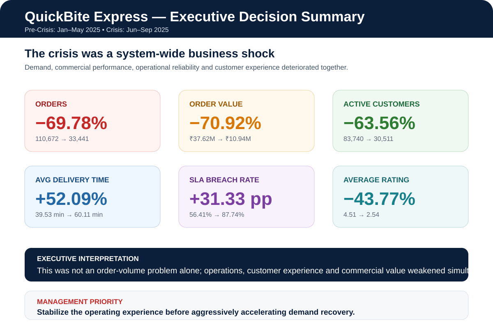

# QuickBite Express — Crisis Recovery Analytics

> End-to-end analytics case study using Python and MySQL/SQL to diagnose a food-delivery business crisis and translate the findings into recovery priorities.

<p align="center">
  
</p>

## Executive Summary

QuickBite Express experienced a major disruption beginning in **June 2025**. This project compares the **pre-crisis period (January–May 2025)** with the **crisis period (June–September 2025)** across eight relational datasets covering customers, restaurants, orders, order items, delivery performance, and ratings.

The analysis shows that the problem was broader than a simple demand decline. Customer activity, order value, delivery reliability, ratings, and retention signals all deteriorated during the crisis period.

| KPI | Change |
|---|---:|
| Orders | **-69.78%** |
| Order value | **-70.92%** |
| Active customers | **-63.56%** |
| Average delivery time | **+52.09%** |
| SLA breach rate | **+31.33 percentage points** |
| Average customer rating | **-43.77%** |
| Cancellation rate | **3.40% → 6.87%** |

## Business Questions

- How large was the decline in demand and order value?
- Which customer, city, and restaurant segments were most affected?
- How did delivery time, SLA performance, and cancellations change?
- Did customer ratings deteriorate during the same period?
- Which historically valuable customers reduced activity?
- Which recovery actions should management prioritize?

## Data Source & Scope

The analysis uses a **supplied case-study dataset package** consisting of eight relational CSV files included in this repository. The business-crisis narrative and comparison periods come from the supplied project brief; the analytical work in this repository evaluates the patterns present in those project inputs.

## Data Model

| Dataset | Purpose / grain |
|---|---|
| `dim_customer.csv` | One row per customer |
| `dim_delivery_partner_.csv` | One row per delivery partner |
| `dim_restaurant.csv` | One row per restaurant |
| `dim_menu_item.csv` | One row per menu item |
| `fact_orders.csv` | One row per order |
| `fact_order_items.csv` | Order-item level detail |
| `fact_delivery_performance.csv` | Delivery metrics by order |
| `fact_ratings.csv` | Rating / review records |

## Analytical Workflow

```text
Raw relational data
      ↓
Python inspection and cleaning
      ↓
Data-quality and integrity validation
      ↓
Feature engineering and EDA
      ↓
MySQL relational validation
      ↓
Reusable SQL analytics layer
      ↓
KPI and segment analysis
      ↓
Business diagnosis
      ↓
Recovery priorities
```

## Data Quality Work

Before KPI analysis, the project checks:

- table grain and duplicate business keys
- null and duplicate identifiers
- orphaned records across joins
- rating and quantity business rules
- negative financial / delivery values
- order-value reconciliation
- item-level vs order-level subtotal consistency
- cancelled-order financial consistency

## Validation & Limitations

- Table grain, nulls, duplicate identifiers, and key relationships were checked before KPI analysis.
- Orphan checks were performed across the main customer, restaurant, order, item, delivery, and rating relationships.
- Financial reconciliation and order-item consistency checks were performed instead of assuming the source data was perfectly aligned.
- Cancelled-order financial consistency and basic business-rule checks were also included.
- These checks reduce the risk that major KPI shifts are caused by obvious join, grain, or integrity errors, but they do **not** independently prove that the external crisis scenario caused every observed change.
- The crisis context comes from the supplied business brief; the analysis is descriptive and decision-support oriented rather than causal.
- Any estimated order-value gap reported in the broader project should be interpreted as an **analytical order-value estimate**, not as audited accounting revenue loss.

## SQL Analytics Layer

The SQL work includes:

- schema and index inspection
- grain validation
- key-integrity checks
- relationship validation
- pre-crisis vs crisis comparisons
- monthly KPI trends
- customer activity analysis
- restaurant and city performance
- delivery and SLA analysis
- cancellation analysis
- ratings analysis
- high-value customer analysis
- reusable analytical views

Techniques include **joins, CTEs, subqueries, CASE expressions, aggregations, date analysis, and window functions**.

## Key Findings

### Demand and commercial performance
- Orders fell from **110,672 to 33,441 (-69.78%)**.
- Order value declined from **₹37.62M to ₹10.94M (-70.92%)**.
- Active customers declined by **63.56%**, showing that the contraction was not limited to order frequency alone.

### Operations
- Average delivery time increased from **39.53 to 60.11 minutes**.
- SLA breach rate increased from **56.41% to 87.74%**, a deterioration of **31.33 percentage points**.
- Cancellation rate increased from **3.40% to 6.87%**.

### Customer experience
- Average rating declined from **4.51 to 2.54** across the comparison periods.
- This is treated as an experience signal observed during the crisis period, not proof that delivery performance or any single factor directly caused the rating decline.

### Customer value risk
- **49 of 58 loyal customers** were classified as churned in the project analysis.
- **4,156 of 4,188 high-value customers** showed declining activity.
- These segments represent the clearest retention risk identified in the supplied analysis.

## Recovery Priorities

1. **Reduce the 31.33-point SLA deterioration** — prioritize operational actions that address the increase from **56.41% to 87.74%** SLA breaches.
2. **Protect high-value customers** — focus retention analysis on the **4,156 high-value customers** whose activity declined.
3. **Target the steepest-loss markets** — prioritize cities and restaurants with the largest measured order declines rather than applying recovery actions uniformly.
4. **Address cancellation growth** — investigate the increase from **3.40% to 6.87%** alongside delivery delays and service-quality signals.
5. **Rebuild customer experience** — use the rating decline from **4.51 to 2.54** and review patterns to identify recurring service issues.

## Supporting Reports

The full QuickBite analysis includes business-understanding, domain-research, storytelling, executive-presentation and final-executive-report deliverables. The visual above is adapted from the **Executive Decision Summary** in the final report.

## Repository Contents

```text
QuickBite-Crisis-Recovery-Analytics/
├── README.md
├── quickbite_crisis_analysis.ipynb
├── sql/
│   └── quickbite_bi_analytics.sql
├── assets/
│   └── quickbite-executive-summary.svg
└── source CSV datasets
```

> The repository contains the analytical notebook, SQL layer, source datasets, and an executive KPI summary visual.

## Tech Stack

**Python:** Pandas, NumPy, Matplotlib, Seaborn  
**Database:** MySQL  
**SQL:** joins, CTEs, window functions, validation queries, analytical views  
**Environment:** Jupyter Notebook, Git, GitHub

## What This Project Demonstrates

**Validate the data → define the comparison → quantify the change → locate the operational problem → identify affected segments → translate findings into decisions.**
